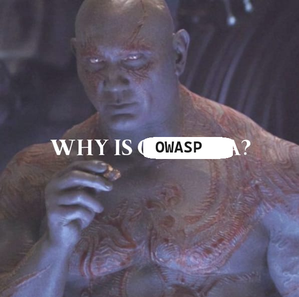

## Unwrapping the OWASP Top-10 : Why the Classics Still Matter

The OWASP Top 10 is a cybersecurity checklist that identifies the most critical web application security risks. Despite the influx of flashy new threats in the wild, the Top 10 remains relevant because it focuses on widespread impactful vulnerabilities that consistently jeopardize web apps. 

As we approach the end of 2023🎄✨, I want to explore these enduring vulnerabilities, focusing on why they remain relevant and how we can implement practical solutions to secure our applications for the future.

### First up, what is OWASP?
The Open Web/Worldwide Application Security Project, commonly known as OWASP, is a non-profit foundation dedicated to enhancing the security of software applications worldwide. 

Founded on the principles of collaboration and knowledge sharing, OWASP has evolved into a beacon for enthusiasts, developers, and cybersecurity professionals alike. They maintain and provide multiple projects aimed at providing security and training for Web, APIs and mobile applications, These include [Firewall Core Rulesets](https://owasp.org/www-project-modsecurity-core-rule-set/) commonnly used in cloud managed Web Application Firewalls, the [OWASP Juice Shop](https://owasp.org/www-project-juice-shop/) a go-to-resource for practicing web app testing and the [Web Security Testing Guide](https://owasp.org/www-project-web-security-testing-guide/). 

In this 2 part series we are going to focus on argubly their most famous project, the [OWASP Top 10](https://owasp.org/www-project-top-ten/).

### Why OWASP Top 10?

this is a test 
{: .left }

### Further Reading

For more information about the OWASP Foundation, including cheatsheets and local chapters, head over to t